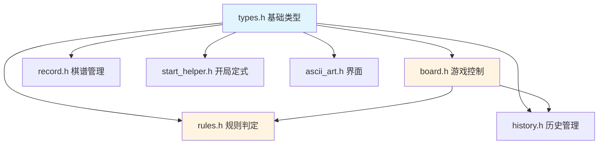
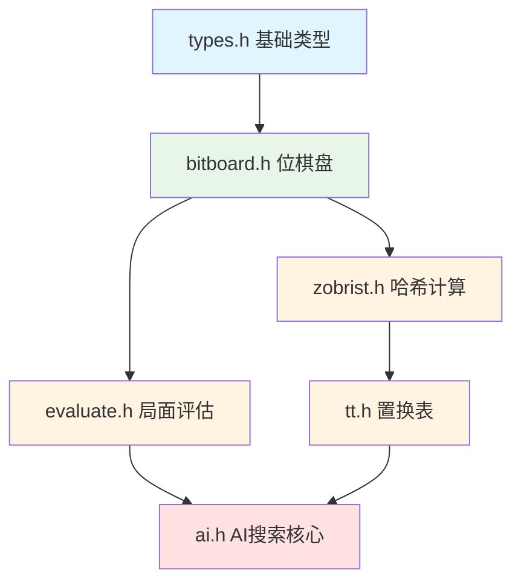

# 头文件接口与数据结构定义

本文档整理了 `include/` 目录下所有头文件暴露的数据结构、枚举、常量及函数接口。按照依赖关系，基础定义（如 `types.h`）位于文档前部。

## 1. 基础类型定义 (types.h)

`types.h` 定义了游戏核心的数据结构和枚举类型，被几乎所有其他模块引用。

### 1.1 枚举类型

| 枚举名称 | 定义 | 描述 |
| :--- | :--- | :--- |
| `CellState` | `enum { EMPTY = 0, BLACK = 1, WHITE = 2 }` | 棋盘格子的状态：空、黑子、白子。 |
| `Player` | `enum { PLAYER_BLACK = 1, PLAYER_WHITE = 2 }` | 玩家标识。 |
| `GameMode` | `enum { MODE_PVP, MODE_PVE }` | 游戏模式：人人对战、人机对战。 |
| `RuleType` | `enum { RULE_STANDARD, RULE_NO_FORBIDDEN }` | 规则类型：标准五子棋（带禁手）、无禁手。 |

### 1.2 基础结构体

| 结构体名称 | 成员概要 | 描述 |
| :--- | :--- | :--- |
| `Position` | `int row; int col;` | 表示棋盘上的坐标。 |
| `Line` | `unsigned short` (typedef) | 16位整数，用于表示一条线上的棋子分布（位压缩）。 |

### 1.3 核心数据结构

**`PlayerBitBoard`**
存储单个玩家在四个方向上的位棋盘数据。
```c
typedef struct {
    Line cols[BOARD_SIZE];          // 列方向
    Line rows[BOARD_SIZE];          // 行方向
    Line diag1[BOARD_SIZE * 2];     // 主对角线方向 (Index: row - col + 14)
    Line diag2[BOARD_SIZE * 2];     // 副对角线方向 (Index: row + col)
} PlayerBitBoard;
```

**`BitBoardState`**
包含双方的位棋盘、占用情况以及邻域（Move Mask）。
```c
typedef struct {
    PlayerBitBoard black;       // 黑方位棋盘
    PlayerBitBoard white;       // 白方位棋盘
    Line occupy[BOARD_SIZE];    // 总占用位 (0=占用, 1=空)
    Line move_mask[BOARD_SIZE]; // 有效落子邻域掩码 (1=有效, 0=无效)
    unsigned long long hash;    // Zobrist 哈希值
} BitBoardState;
```

**`GameState`**
完整的游戏状态，包含棋盘数组和位棋盘，以及历史记录。
```c
typedef struct {
    CellState board[BOARD_SIZE][BOARD_SIZE]; // 传统二维数组棋盘
    BitBoardState bitBoard;                  // 位棋盘状态
    Player currentPlayer;                    // 当前执子玩家
    Position lastMove;                       // 最后一步落子
    int moveCount;                           // 总步数
    GameMode mode;                           
    RuleType ruleType;
    struct HistoryNode* historyHead;         // 历史记录栈顶
} GameState;
```

**`HistoryNode`**
历史记录节点，用于悔棋。包含 `GameState` 的快照。
```c
typedef struct HistoryNode {
    CellState board[BOARD_SIZE][BOARD_SIZE];
    BitBoardState bitBoard; 
    Player currentPlayer;
    Position lastMove;
    int moveCount;
    struct HistoryNode* next;
} HistoryNode;
```

---

# 游戏业务模块

此部分包含五子棋游戏的核心业务逻辑，包括棋盘管理、规则判定、历史记录等功能。



## 2. 游戏逻辑与控制 (board.h)

处理游戏的高层逻辑，如初始化、打印、落子判定。

| 接口名称 | 功能描述 |
| :--- | :--- |
| `void initGame(GameState *game, GameMode mode, RuleType rule)` | 初始化游戏对象。 |
| `void printBoard(const GameState *game)` | 打印棋盘到控制台。 |
| `int makeMove(GameState *game, int row, int col)` | 执行落子操作，包含合法性检查和状态更新。成功返回 1。 |
| `int isBoardFull(const GameState *game)` | 检查棋盘是否填满。 |

---

## 3. 规则判定 (rules.h)

定义了落子合法性检查和胜负判定，特别是禁手规则。

### 3.1 常量定义 (错误码)

| 宏名称 | 值 | 描述 |
| :--- | :--- | :--- |
| `VALID_MOVE` | 0 | 合法落子 |
| `ERR_OUT_OF_BOUNDS` | 1 | 越界 |
| `ERR_OCCUPIED` | 2 | 位置已被占用 |
| `ERR_FORBIDDEN_33` | 3 | 三三禁手 |
| `ERR_FORBIDDEN_44` | 4 | 四四禁手 |
| `ERR_FORBIDDEN_OVERLINE` | 5 | 长连禁手 |

### 3.2 接口

| 接口名称 | 功能描述 |
| :--- | :--- |
| `int checkValidMove(const GameState *game, int row, int col)` | 检查落子是否合法，返回上述错误码之一。 |
| `int checkWin(const GameState *game)` | 检查胜负。返回胜者 (`PLAYER_BLACK`/`WHITE`) 或 0。 |
| `int isForbidden(const GameState *game, int row, int col)` | 专门检查黑方禁手情况。 |

---

## 4. 历史记录 (history.h)

提供撤销/悔棋功能。

| 接口名称 | 功能描述 |
| :--- | :--- |
| `void pushState(GameState *game)` | 保存当前状态到历史栈。 |
| `int undoMove(GameState *game)` | 弹出历史栈顶状态以恢复局面。成功返回 1。 |
| `void clearHistory(GameState *game)` | 清空历史栈。 |

---

## 5. 棋谱管理 (record.h)

| 接口名称 | 功能描述 |
| :--- | :--- |
| `int record(GameState* game)` | 保存棋谱。 |
| `int load(GameState* game, char* filename)` | 加载棋谱。 |

---

## 6. 开局定式 (start_helper.h)

| 接口名称 | 功能描述 |
| :--- | :--- |
| `int start_helper(GameState *game)` | 尝试匹配开局库定式。 |

---

## 7. 界面辅助 (ascii_art.h)

| 接口名称 | 功能描述 |
| :--- | :--- |
| `void setAsciiFaceFlag(int flag)` | 控制 ASCII 表情开关。 |
| `void printAsciiArray(...)` | 打印 ASCII 字符画。 |

---

# 位棋盘模块（游戏业务与AI的桥梁）

位棋盘是连接游戏业务逻辑和AI搜索的关键数据结构，为AI提供高效的走法生成和状态更新能力。

## 8. 位棋盘操作 (bitboard.h)

`bitboard.h` 提供了维护 `BitBoardState` 的高效API，支持增量更新和快速走法生成。

| 接口名称 | 功能描述 |
| :--- | :--- |
| `void initBitBoard(BitBoardState *bitBoard)` | 初始化位棋盘状态。 |
| `void updateBitBoard(BitBoardState *bitBoard, int row, int col, Player player, Line* backup_mask)` | 在位棋盘上执子，并更新行、列、对角线及 Zobrist 哈希。`backup_mask` 用于存储更新前的邻域掩码以便撤销。 |
| `void undoBitBoard(BitBoardState *bitBoard, int row, int col, Player player, const Line* backup_mask)` | 撤销位棋盘上的一步落子。 |
| `int generateMoves(const BitBoardState *bitBoard, Position *moves)` | 根据 Move Mask 生成所有合法邻域落子点，存入 `moves`，返回数量。 |

---

# AI 相关模块

此部分实现五子棋AI的核心算法，包括局面评估、搜索优化（置换表）、哈希计算和博弈树搜索。



## 9. Zobrist 哈希 (zobrist.h)

用于快速计算局面哈希，支持置换表。

| 接口名称 | 功能描述 |
| :--- | :--- |
| `void initZobrist()` | 初始化随机数表。 |
| `uint64_t calculateZobristHash(const BitBoardState* board, Player currentPlayer)` | 从头计算当前局面的 Zobrist 哈希值。 |

---

## 10. 局面评估 (evaluate.h)

提供针对位棋盘的高效评估函数，支持 SIMD 友好型的数据结构。

### 10.1 数据结构

**`Lines4` / `DualLines`**
用于并行处理多条线的评分结构。
```c
typedef struct {
    unsigned long long low;  // 64位，包含2条线的对于某方的分数
    unsigned long long high; // 64位，包含另外2条线
} Lines4;

typedef struct {
    Lines4 me;
    Lines4 enemy;
} DualLines;
```

### 10.2 接口

| 接口名称 | 功能描述 |
| :--- | :--- |
| `unsigned long long evaluateLines2(...)` | 并行评估两条线。（初始化时使用） |
| `DualLines evaluateLines4(...)` | 并行评估双方四条线。 |
| `int evaluateBoard(const BitBoardState *bitBoard, Player player)` | 计算单一玩家的全盘分数。 |
| `int evaluate(const BitBoardState *bitBoard)` | 计算当前局面净胜分。 |

---

## 11. 置换表 (tt.h)

Transposition Table，用于缓存搜索结果，减少重复计算。

### 11.1 数据结构与常量

**Flag 类型**
- `TT_FLAG_NONE` (0)
- `TT_FLAG_EXACT` (1): 精确值
- `TT_FLAG_LOWERBOUND` (2): 下界 (Alpha 剪枝)
- `TT_FLAG_UPPERBOUND` (3): 上界 (Beta 剪枝)

**`TTEntry`**
```c
typedef struct {
    uint64_t key;               // 对应的 Zobrist Hash
    uint32_t rem_depth : 7;     // 剩余搜索深度
    uint32_t abs_depth : 7;     // 绝对深度
    uint32_t flag      : 2;     // 标记类型
    uint32_t age       : 8;     // 存活时间/代数
    uint32_t best_move : 8;     // 压缩后的最佳着法 (Row * 15 + Col)
    int32_t value;              // 评估分值
} TTEntry;
```

### 11.2 接口

| 接口名称 | 功能描述 |
| :--- | :--- |
| `void tt_init(int size_mb)` | 初始化置换表内存。 |
| `void tt_free()` | 释放置换表。 |
| `void tt_clear()` | 清空表内容。 |
| `int tt_probe(uint64_t key, int rem_depth, int ply, int* alpha, int* beta, int* out_val, Position* out_move);` | 查询置换表，可能会更新 alpha/beta，若满足剪枝条件返回 1。 |
| `void tt_save(uint64_t key, int rem_depth, int value, int flag, Position best_move);` | 将搜索结果写入置换表。 |
| `void tt_prefetch(uint64_t key)` | 预取指令。 |

---

## 12. AI 核心 (ai.h)

包含搜索算法所需的数据结构定义，暴露进入ai思考的API。

### 12.1 数据结构

**`EvalState`**
增量评估状态，缓存各线分数。
```c
typedef struct {
    long long line_net_scores[4][MAX_LINES]; // 4个方向各线的净分
    long long count_live3[4][MAX_LINES];     // 活三计数缓存
    long long count_4[4][MAX_LINES];         // 冲四/活四计数缓存
    long long total_score;                   // 全局总分
} EvalState;
```

**`UndoInfo`**
用于回溯搜索时恢复状态。
```c
typedef struct {
    Line move_mask_backup[15];
    long long old_line_net_scores[4];
    long long old_total_score;
    // ... 其他备份字段
} UndoInfo;
```

**`SearchContext`**
搜索线程上下文，包含杀手着法表、统计信息和本地棋盘副本。
```c
typedef struct {
    Position killer_moves[MAX_DEPTH][2];
    unsigned long long nodes_searched;
    BitBoardState board;
    EvalState eval;
} SearchContext;
```

### 12.2 接口

| 接口名称 | 功能描述 |
| :--- | :--- |
| `Position getAIMove(const GameState *game)` | AI 计算主入口，返回最佳落子点。 |
