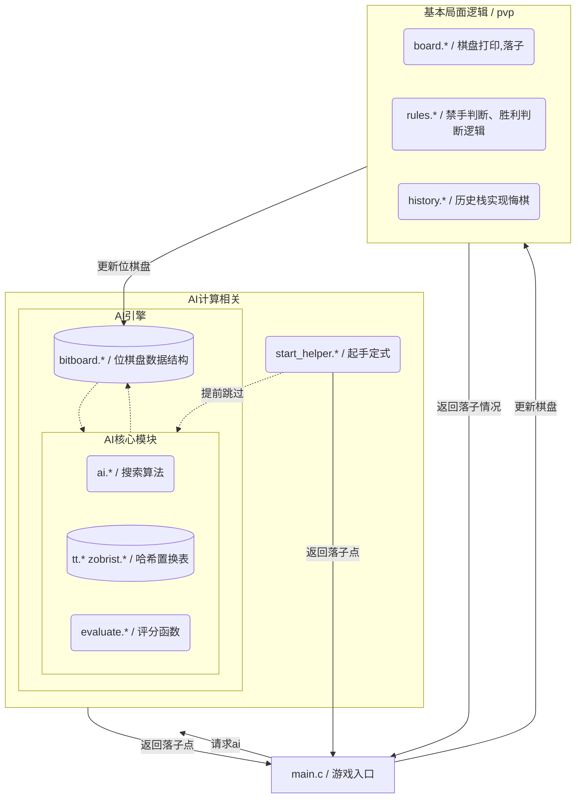

# 五子棋 (Gomoku) 项目开发文档
## 模块图
总模块图如下：

这是本项目所有代码的从属及交互结构。
使用meraid图可以很好的表示各个模块之间的从属关系。`ascii_art.*`是一个破坏了模块化设计的花活，故不纳入图像。此外，`types.h`涵盖所有主要的数据类型，全局通用。
之后围绕图中不同模块层次展开说明：
## AI计算相关
这个模块分为两部分
- 开局定式助手
- AI引擎

在游戏运行的过程中，如开启pve，`main`会在ai执棋的轮次向AI计算相关的模块发起请求。若`start_helper`条件判断成功，直接返回定式的落子点。若不符合定式情况或棋步数大于5，则将落子请求下放到AI引擎模块

### AI引擎
此模块是负责ai计算的模块：
- bitBoard:位棋盘，AI模块专用的数据结构，它和`基本局面逻辑`模块中的board同步更新，也是`AI引擎`模块获取外界棋局信息的唯一通道。每个玩家都有自己的位棋盘，包括15条row,15条col，以及两个对角线分别29条，共88 * 2 = 176条 `unsigned short` 类型的位表示。
- AI核心模块：执行搜索算法、局面评估的核心模块，cpu周期数开销占总开销的75%以上

#### AI核心模块

- `evaluate.*`是和位棋盘表示交互的评分函数。通过执行大量位计算能够并行算出每个方向有哪些连珠、活三、冲三、活跳三、活四、冲四、跳四、强活二、活二、冲二，其模式匹配规则共10条，均通过位运算并行计算。其中活三、四的数量信息也能通过评分来提供，以便高效处理禁手
- `ai.*`执行主要的搜索算法逻辑，同时负责将`bitBoard`的数据打包给`evaluate`便于并行化运算，以及维护88条线得分的缓存数据。
  - 其搜索算法为基于alpha-beta搜索的pvs+迭代加深，默认参数在`ai.h`，配合置换表，可以较快速执行12层的搜索
  - 自带以较低开销完成的简单禁手判断，只需对`evaluate`评估的分数返回值进行掩码运算即可
- `哈希置换表`存储了某一局面特有的ai分析信息，比如搜索层数、评估分数、分数类型等。

## 基本局面逻辑

处理落子、悔棋、禁手判断、胜负手判断的独立模块。离开ai模块也能独立完成pvp工作。
- 悔棋：结构体`gameState`包含局面所需的全部信息，故只需向history栈中压入`gameState`就可以实现悔棋。
- 规则判断：`rules.*`实现了递归判断复杂禁手，同样采用位运算
- 基本棋盘逻辑：`board.*`提供了判断棋盘是否已满、在棋盘上落子、在stdout上打印棋盘（以及超天酱）等基础接口
## 一些杂碎

最初的版本采用一次评估一个方向的`evaluate`+朴素的`alpha-beta`剪枝搜索，只能在可行的时间内执行6层递归搜索。能够来到高效的12层搜索，离不开`evaluate`层、数据结构以及搜索算法层的不断优化。
### 评估函数的优化

使用位棋盘位运算做评估是本项目比较有特色的实现。这个实现的好处是模式匹配规则清晰、简易、直观，不用写任何长长的`switch case`，实现逻辑会显得更优雅，也更适合我这种五子棋小白以有限的游戏理解去实现不熟输大佬的评分水平。代价就是每个模式匹配规则都会带来运算量开销，性能捉急。但好处是我们可以采用并行化运算的方案来填补性能短板。

我们的棋盘大小为15格，而模式匹配规则中最远可以匹配到距离为4的格（不计五子连珠），因此使用19个位来存储一个方向的位棋盘是安全的。

由此，可以将两个方向的位棋盘表示用一个64位无符号整数来并行运算，高32位存第一个方向，低32位存第二个方向，这样执行完全相同的运算步骤就可以判断出两条线。于是就有了第一个优化版本`evaluateLines2`，总速度快了将近一倍。

同样我们可以利用现代cpu多发射的功能特性，将四个方向的位棋盘用一个128位的整型（结构体Lines4）打包并行运算，这就是初代`evaluateLines4`，经过测试速度相比`evaluateLines2`快了70%。

此时搭配加入每层宽度限制的朴素alpha-beta搜索，已经可以在有效时间内跑每层15宽度，8层的递归搜索，棋力取得了第一次突破。

为了最大化利用多发射执行的效率优势，我又在后续将我方的4条线和敌人的4条线组成256位的整数放进了同一个函数同步计算，即`evaluateLines4`的第二个版本。此版本的评估效率再次上升了40%左右。之后相当长时间内，我都采用这个标量版本的评估函数。

此函数搭配朴素alpha-beta搜索可以跑到10层深度11宽度，其速度跟普通棋盘的switch case评分速度已经看不出明显差距。

在ai搜索算法优化完成后，我又改动了`evaluateLines4`，将其拆成4个unsigned long long作循环，并标注使得`avx2`向量化了一部分代码。虽然总指令数由932行降低到624行，但因为模式匹配都需要在for循环后以标量指令`__builtin__popcountll`计分，所以采用了大量临时变量储存，导致产生了更多的内存操作，最后总性能只提升了5%左右。在无特殊情况（比如指令集不支持）时仍沿用这个`evaluateLines4`向量化版本。

### 数据结构与算法优化

这个优化过程充分体现数据结构与算法为什么很难分离开来单独讨论。

做剪枝搜索优化的一个核心就是有一个好的启发式排序。具体来说，就是要定义哪些节点适合走。在算法的语境中，好的节点就是要那些能制造出大量beta剪枝的节点。这证明该节点有极大的“必然性”，很可能就是接下来几轮棋局唯一的发展路径。只要先搜索了一个好的节点，之后几轮的搜索就会遇到一个被抬得很高的alpha，它们也会被大量的剪枝，这样大量不必要的计算就可以省略了。

迭代加深搜索和杀手启发，都是围绕着怎么去获得一个优质的启发式排序的。

我的启发式排序一开始是一个朴素实现：静态评估可走节点中每个节点的分数，然后分别排序。这样的排序相当于深度为1的威胁评估，其实已经有了迭代加深搜索的影子。

在迭代加深搜索中，依次做深度为2、4、6、8、10的搜索（相当于对局1轮，2轮，3轮，4轮，5轮），然后将前一轮搜索的最佳走法放到后一轮搜索的根节点排序队列首位。这就相当于我搜索第n层时，已经记住了深度为n-2层的威胁评估中最好的走法，它往往就是相对很好的走法，可以触发很多剪枝。

如果仅仅从目前算法的角度，迭代加深搜索的平均开销会比普通的搜索增加10%，相当于用很大的开销，仅仅去换一个比较好的排序节点。这样它的性能表现其实并不能有很多提升。但是如果加上一个崭新的数据结构，迭代加深搜索就成了大杀器。

对于一个相同的局面，我们可以用hash表来近似唯一确定。在五子棋的搜索树中，其实每次搜索会遇到过大量之前就出现过一模一样的局面，但是因为搜索树没有记忆，它会傻傻地接着往下搜索。如果我们能把它缓存起来，让ai有记忆，它看到某个局面，先去回忆一下之前搜没搜过相同的局面，如果之前的确搜到了相同的局面，而且该局面在之前搜索树的剩余深度还比我搜到的要深，那我就能直接拿过来用，整个搜索树到这里就不用再加深了。这就是Zobrist TT的main idea。

在上面一段中，已经蕴含了迭代加深搜索和Zobrist TT密不可分的线索——如果没有迭代加深搜索，而是固定深度的朴素alpha-beta搜索，Zobrist TT置换表对剪枝效率的贡献就非常小：如果同一局面在我当前搜索树建立之前就被搜到过，那它的剩余深度恒小于我的剩余深度，搜索就永远不会直接取走它的值并触发剪枝。但有了迭代加深搜索，在前几回合建立的搜索树就会有大量的深节点，这些深节点会极大地增加搜索树触发剪枝的可能性。总体的搜索节点数就会有极大的下降。

因此，Zobrist置换表极大加速了迭代加深搜索，而正是迭代加深搜索赋予Zobrist置换表以意义，这是一个算法与数据结构相互成就的实例。虽然由于访问内存，单次搜索的时间开销变大了，但是节点数的下降是立竿见影的。

杀手启发的实现相对简单许多——我们可以把每一层造成beta剪枝的两个节点存起来，下次搜索树生长到这一层时，直接就把这两个被证明能造成剪枝的节点放在排序队列首。这个实现属于开销几乎可以忽略不计，但是效果很好，无本万利。

我使用Zobrist + 迭代加深搜索 + 杀手启发，成功将搜索层数推进到12层，并且反应很快，努努力还有推进到14层的潜力。这时已经很接近优化的尾声了

PVS搜索和mtd(f)搜索是一对采用了零窗口搜索的加强算法，它们的详细实现也比较好玩，但是也很简单，网上前人之述备矣，不多展开。mtd(f)搜索对并发有一个良好的支持。我起初出于并发编程的野心实现了mtd(f)搜索。不带并发版本的mtd(f)本身就可以带来大约12%的总时间优化，但是单次评估的收敛速度不稳定，导致整体对局体验不是很流畅。我基于mtd(f)尝试实现基础的Lazy BMP并发，结果时间开销惨不忍睹。我之后又在无望中挣扎了许久，最后放弃了并发，转而使用相对更稳定的PVS搜索。值得一提的是，它们并不矛盾，可以混合使用效果更佳。但是我最终的提交版本彻底删没了mtd(f)的痕迹，留下一片比较干净的代码块。有心之人可以尝试并发，突破14层界限。

## 一些可能有价值的弃用方向

- 如上所述，试图实现mtd(f)+并发编程，但最终效果稀烂，遂放弃
- 关于`ai.c`中的缓存机制，我有一套截然不同的优化方案，但是需要重构代码：之前提及过最大汉明距离是4，所以15位棋盘需要19位的空间来存放，才保证每条方向之间不会串台。为此每32位放一个线，造成了大量资源浪费。实际上，检测每个落子点及其前后5位，最多共11位的数据就够了。而11 + 4 = 15，因此正好可以用64位整型存进一步压缩后的4个方向，这样数据吞吐量提升了1倍。我们就可以基于这个实现，去删除掉`ai.c`中一切缓存88条线的代码，每次将落子前后的敌我双方共4 * 2 * 2 = 16条线全都打包传给`evaluateLines4`。这样的好处是可以将`evaluateLines4`中的标量操作直接砍半，再也不用把每条线返回了，返回每次的总分变化即可。代价是打包操作反而开销变大了，但是原来的数据打包也不轻松。这个方向是比较有潜力的优化方向，但是我写了一半发现这个方向要改的代码实在过多，而带来性能优化显然也不足以让我突破14层大坎，所以就弃用了，回退版本。
- 12层定深的搜索有些缺乏弹性，有一种基于强迫性走法变深搜索的idea,具体就是出现活三、冲四这种强迫性局面时候，对方下棋可能性只有一种或两种，这个搜索树近似没有增长分支，可以再往下搜更深，直到找到必杀局。似乎叫做算杀，但是我没深入研究过。
- `evaluateLines4`基于位运算的匹配规则虽然清晰，但是毕竟开销过大。如果利用位棋盘摘取落子点的邻域，搞4次单个方向的switch case，这部分的开销应该会减少很多。但是我是具体业务方面的懒狗，不敢写密密麻麻的switch case，遂放弃。
- 由于课程要求，目前ai执黑棋只考虑简单禁手，但是课程要求出来前完成的`rules.*`却是按照判断复杂禁手的规则集去实现的。实际上写个简化版`evaluateLines4`专门评估活三和四，做低开销的递归解禁也并不困难。
- 由于`evaluateLines4`的评估简洁，可以非常方便地搞两套不同的评分宏去分别适配ai执黑、执白的评分规则，但我目前懒得考虑什么样的评分规则适合黑棋下，什么样的评分规则适合白棋下。（作为真·小白，本来的评分宏就是凭感觉给定的）如果后续有增强棋力的需求再说吧。

## 附记

- 性能测试采用linux命令行自带的`perf`,`time`
- 字符艺术由于缺少超天酱的网络素材，由我自己生成/手绘