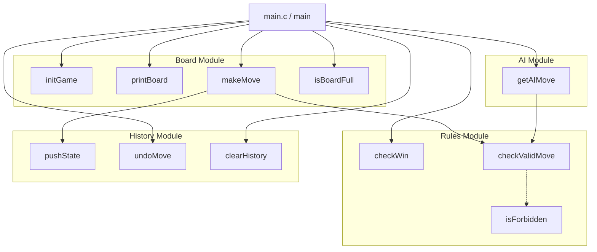

# 五子棋 (Gomoku) 项目开发文档

## 1. 概述
五子棋，支持pvp和pve，具备完善的规则判定（包括标准禁手规则）和悔棋功能。

## 2. 目录结构
项目遵循的目录结构：

```
Gomoku/
├── Makefile          
├── build/            # 编译输出目录
├── include/          # 头文件目录
│   ├── ai.h          
│   ├── board.h       
│   ├── history.h     
│   ├── rules.h       
│   └── types.h       
└── src/             # 源代码目录
    ├── ai.c          
    ├── board.c       
    ├── history.c     
    ├── main.c        
    └── rules.c       
```

## 3. 各模块详细信息

### 3.1 基本的数据结构 (`include/types.h`)
定义了游戏的基础类型，确保各模块间的数据一致性。
*   **`GameState`**: 游戏核心状态，包含以下成员：
    - `board`：棋盘数组
    - `currentPlayer`：当前玩家
    - `lastMove`：最后落子位置
    - `mode`：游戏模式
    - `ruleType`：规则类型
    - `historyHead`：历史记录栈指针，悔棋用
*   **`CellState`**: 棋盘格状态 
  (`EMPTY`, `BLACK`, `WHITE`)。
*   **`Player`**: 黑白棋标识
   (`PLAYER_BLACK`, `PLAYER_WHITE`)。
*   **`GameMode`**: 游戏模式
   (`MODE_PVP`, `MODE_PVE`)。
*   **`RuleType`**: 规则集 
  (`RULE_STANDARD` - 标准禁手
 `RULE_NO_FORBIDDEN` - 无禁手)。

### 3.2 棋盘模块 (`src/board.c`)
负责游戏状态的初始化、更新和渲染。
*   `initGame`: 初始化GameState
*   `printBoard`: 打印棋盘
*   `makeMove`: 执行落子操作，更新棋盘状态并切换玩家。在落子前将当前状态压入历史栈。

### 3.3 规则模块 (`src/rules.c`)
负责合法性检查和胜负判定。
*   `checkValidMove`：
  检查落子是否合法：
    - 检查边界
    - 检查是否有棋子
    - 检查是否为禁手位
*   `checkWin`: 检查当前局面是否有五连珠。
*   `isForbidden`: **禁手逻辑核心**。目前已实现长连禁手 (Overline) 检测。
    *   *TODO*: 完善三三禁手 (3-3) 和四四禁手 (4-4) 的检测逻辑。

### 3.4 历史模块 (`src/history.c`)
实现悔棋功能。
*   使用栈 (`HistoryNode`) 存储每一步的 `GameState` 快照。
*   `pushState`: 落子前保存状态。
*   `undoMove`: 弹出栈顶状态以恢复局面。
*   `clearHistory`: free掉所有历史记录（游戏结束时调用）。

### 3.5 AI 模块 (`src/ai.c`)
负责 PvE 模式下的电脑走棋。
*   `getAIMove`: 计算并返回 AI 的落子位置。
*   *当前实现*: 简单的贪心/随机策略（优先占中，随机合法位置）。
*   *计划*: 升级为 Minimax 算法配合 Alpha-Beta 剪枝。

### 3.6 主程序 (`src/main.c`)
处理命令行参数解析和游戏主循环。
*   支持参数:
*   *   `--help`: 查看说明。
    *   `--mode <pvp|pve>`: 设置模式。
    *   `--rules <std|simple>`: 设置规则。
*   如果是pve，在主循环中根据指示输入player执黑/执白。
*   主循环处理用户输入（坐标如 "H8"、命令 "undo"、"quit"），调用各模块接口驱动游戏。

## 4. 编译与运行

### 编译
在项目根目录下执行：
```bash
make
```

### 运行
*   **默认模式 (PvP, 标准规则)**:
    ```bash
    ./build/gomoku
    ```
*   **人机模式 (无禁手)**:
    ```bash
    ./build/gomoku --mode pve --rules simple
    ```

## 5. 待办事项 (TODO)
1.  **完善禁手规则**: 实现完整的三三禁手和四四禁手判定算法。
2.  **AI 升级**: 实现 Minimax 算法与 Alpha-Beta 剪枝，增加搜索深度配置。
3.  **Swap 规则**: 增加 Swap2 等开局规则的支持。

## 6. 调用关系网

以下是项目中各模块函数之间的调用关系图：


